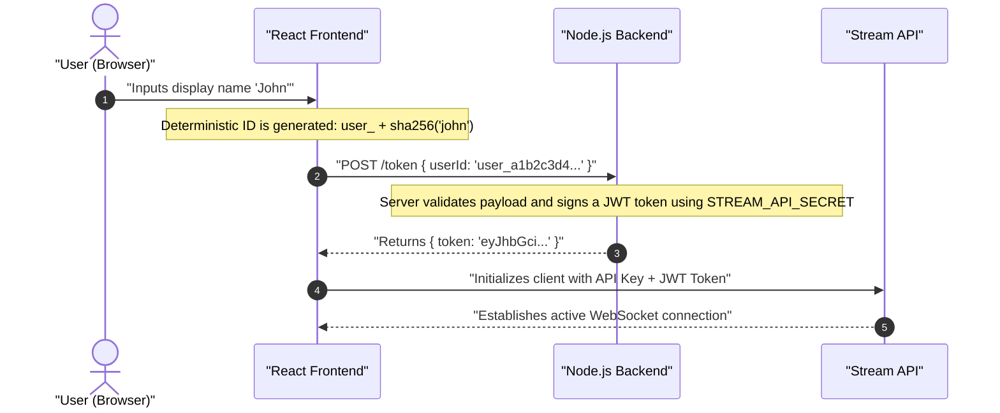
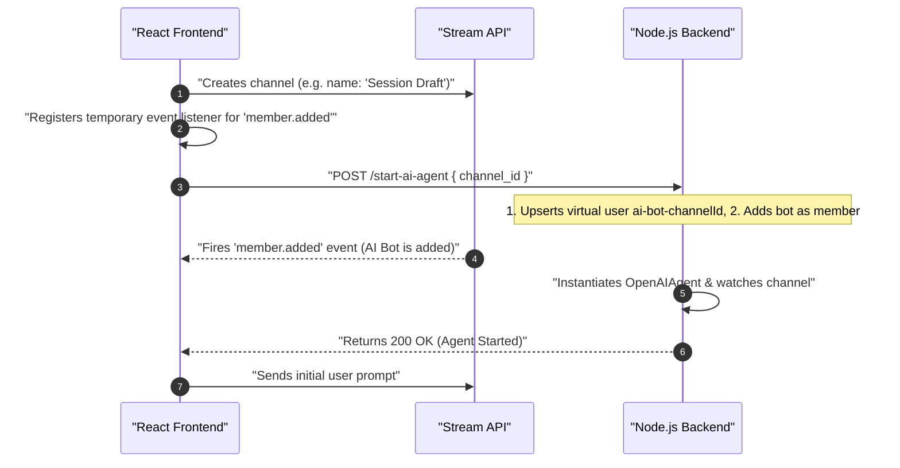
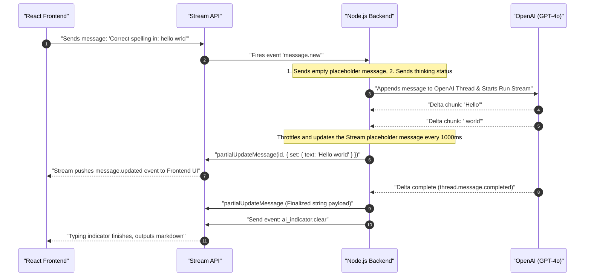
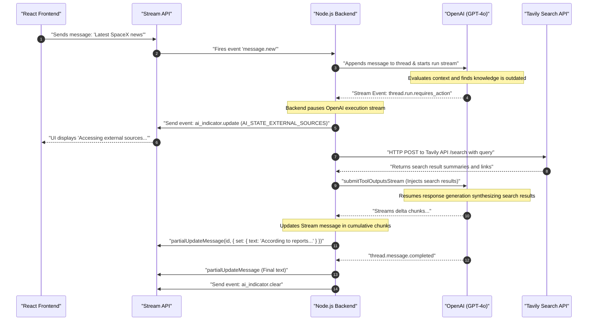

# AI Chat App with Agents: Architecture & Flows Guide

This document provides a detailed breakdown of the system architecture, component responsibilities, and step-by-step data flows for the AI Writing Assistant application. It is designed to serve as a comprehensive reference guide to understand how the React frontend, Node.js backend, GetStream APIs, OpenAI Assistants, and Tavily Search engines coordinate.

---

## 1. Project Directory Structure & Key Files

The codebase is split into a client-side React app and a server-side Node.js/Express server. 

### Backend Layout (`nodejs-ai-assistant/`)
* [src/index.ts](file:///Users/himanshunagar/Documents/prnl/projects/ai-chat-app-with-agents-getstream/nodejs-ai-assistant/src/index.ts): Main Express server entry point. Configures routes (`/token`, `/start-ai-agent`, `/stop-ai-agent`, `/agent-status`) and manages the AI agent memory cache and inactivity cleanup.
* [src/serverClient.ts](file:///Users/himanshunagar/Documents/prnl/projects/ai-chat-app-with-agents-getstream/nodejs-ai-assistant/src/serverClient.ts): Configures the Stream Chat server client using credentials (`STREAM_API_KEY`, `STREAM_API_SECRET`).
* [src/agents/createAgent.ts](file:///Users/himanshunagar/Documents/prnl/projects/ai-chat-app-with-agents-getstream/nodejs-ai-assistant/src/agents/createAgent.ts): Helper that connects a dedicated Stream Chat client for the virtual AI bot user, watches the active channel, and instantiates the platform agent.
* [src/agents/openai/OpenAIAgent.ts](file:///Users/himanshunagar/Documents/prnl/projects/ai-chat-app-with-agents-getstream/nodejs-ai-assistant/src/agents/openai/OpenAIAgent.ts): Handles OpenAI Assistant model creation, creates threads, registers listeners on `message.new` in the Stream channel, and streams output via `OpenAIResponseHandler`.
* [src/agents/openai/OpenAIResponseHandler.ts](file:///Users/himanshunagar/Documents/prnl/projects/ai-chat-app-with-agents-getstream/nodejs-ai-assistant/src/agents/openai/OpenAIResponseHandler.ts): Manages OpenAI's response streams, processes tool requests (Tavily search), broadcasts status indicators, and pushes text updates to GetStream's server.

### Frontend Layout (`react-stream-ai-assistant/`)
* [src/App.tsx](file:///Users/himanshunagar/Documents/prnl/projects/ai-chat-app-with-agents-getstream/react-stream-ai-assistant/src/App.tsx): Routes between authenticated view (`AuthenticatedApp`) and login screen.
* [src/providers/chat-provider.tsx](file:///Users/himanshunagar/Documents/prnl/projects/ai-chat-app-with-agents-getstream/react-stream-ai-assistant/src/providers/chat-provider.tsx): Standard React context wrapper that runs `useCreateChatClient` and fetches JWT tokens from the backend.
* [src/components/login.tsx](file:///Users/himanshunagar/Documents/prnl/projects/ai-chat-app-with-agents-getstream/react-stream-ai-assistant/src/components/login.tsx): Generates a secure, deterministic user ID using SHA-256 and handles authentication prompts.
* [src/components/authenticated-app.tsx](file:///Users/himanshunagar/Documents/prnl/projects/ai-chat-app-with-agents-getstream/react-stream-ai-assistant/src/components/authenticated-app.tsx): Orchestrates sidebar layouts and contains the channel creation flow.
* [src/components/chat-interface.tsx](file:///Users/himanshunagar/Documents/prnl/projects/ai-chat-app-with-agents-getstream/react-stream-ai-assistant/src/components/chat-interface.tsx): Orchestrates the primary header controls (`AIAgentControl`), templates toolbar, and input actions.
* [src/components/chat-message.tsx](file:///Users/himanshunagar/Documents/prnl/projects/ai-chat-app-with-agents-getstream/react-stream-ai-assistant/src/components/chat-message.tsx): Renders custom bubble views, handles Markdown formatting, and runs smooth letter-by-letter typing animations.
* [src/hooks/use-ai-agent-status.tsx](file:///Users/himanshunagar/Documents/prnl/projects/ai-chat-app-with-agents-getstream/react-stream-ai-assistant/src/hooks/use-ai-agent-status.tsx): Polls and manages connectivity statuses of the AI Agent on the backend server.

---

## 2. Component Responsibilities

The system is split into distinct functional areas that communicate asynchronously:

```
+-----------------------------------+
|          React Frontend           |
|  - UI Renders & Event Handlers    |
|  - Websocket client (user-level)  |
+-----------------+-----------------+
                  |
                  | Websockets
                  v
+-----------------------------------+
|         Stream Chat API           |
|  - Syncs channels and messages    |
|  - Dispatches Webhook Events      |
+-----------------+-----------------+
                  |
                  | Server Webhooks / SDK
                  v
+-----------------------------------+
|          Node.js Server           |
|  - Generates JWT Auth Tokens      |
|  - Spawns bot handlers            |
|  - Coordinates OpenAI & Tavily    |
+--------+-----------------+--------+
         |                 |
         | SDK API         | HTTP REST
         v                 v
+--------+-------+ +-------+--------+
|   OpenAI API   | |   Tavily API   |
|   (LLM/Runs)   | |  (Web Search)  |
+----------------+ +----------------+
```

---

## 3. Core Flow 1: Authentication & User Login

This flow verifies user identity and generates signed JWT tokens to authorize client connections to the Stream API without exposing backend secrets.



### Key Implementation Code

#### Frontend: ID Hashing and Login Submission
In [login.tsx](file:///Users/himanshunagar/Documents/prnl/projects/ai-chat-app-with-agents-getstream/react-stream-ai-assistant/src/components/login.tsx#L21-L42), the frontend generates a deterministic, safe string for user IDs and triggers the root state update:
```typescript
const createUserIdFromUsername = (username: string): string => {
  const hash = sha256(username.toLowerCase().trim());
  return `user_${hash.substring(0, 12)}`;
};

const handleSubmit = (e: React.FormEvent) => {
  e.preventDefault();
  if (username.trim()) {
    const user = {
      id: createUserIdFromUsername(username.trim().toLowerCase()),
      name: username.trim(),
    };
    onLogin(user);
  }
};
```

#### Frontend: Client Connection Token Provider
In [chat-provider.tsx](file:///Users/himanshunagar/Documents/prnl/projects/ai-chat-app-with-agents-getstream/react-stream-ai-assistant/src/providers/chat-provider.tsx#L29-L68), the Stream Chat context queries the backend on initialization or connection drops:
```typescript
const tokenProvider = useCallback(async () => {
  const response = await fetch(`${backendUrl}/token`, {
    method: "POST",
    headers: { "Content-Type": "application/json" },
    body: JSON.stringify({ userId: user.id }),
  });
  const { token } = await response.json();
  return token;
}, [user]);

const client = useCreateChatClient({
  apiKey,
  tokenOrProvider: tokenProvider,
  userData: user,
});
```

#### Backend: Token Sign-Off
In [index.ts](file:///Users/himanshunagar/Documents/prnl/projects/ai-chat-app-with-agents-getstream/nodejs-ai-assistant/src/index.ts#L148-L171), the backend generates a JWT token for the requested client ID:
```typescript
app.post("/token", async (req, res) => {
  const { userId } = req.body;
  if (!userId) return res.status(400).json({ error: "userId is required" });

  const issuedAt = Math.floor(Date.now() / 1000);
  const expiration = issuedAt + 60 * 60; // Valid for 1 hour

  const token = serverClient.createToken(userId, expiration, issuedAt);
  res.json({ token });
});
```

---

## 4. Core Flow 2: Writing Session / Channel Creation

This flow handles starting a new writing project. The frontend configures a messaging channel and flags the backend to spin up a dedicated AI agent.



### Key Implementation Code

#### Frontend: Channel Setup & Agent Registration
In [authenticated-app.tsx](file:///Users/himanshunagar/Documents/prnl/projects/ai-chat-app-with-agents-getstream/react-stream-ai-assistant/src/components/authenticated-app.tsx#L56-L99), the application creates the channel, sets up a listener, requests the agent, and fires the prompt after verification:
```typescript
const handleNewChatMessage = async (message: { text: string }) => {
  // 1. Create a new channel with the user as the only member
  const newChannel = client.channel("messaging", uuidv4(), {
    name: message.text.substring(0, 50),
    members: [user.id],
  });
  await newChannel.watch();

  // 2. Set up event listener for when AI agent is added as member
  const memberAddedPromise = new Promise<void>((resolve) => {
    const unsubscribe = newChannel.on("member.added", (event) => {
      if (event.member?.user?.id && event.member.user.id !== user.id) {
        unsubscribe.unsubscribe();
        resolve();
      }
    });
  });

  // 3. Connect the AI agent via backend Express route
  const response = await fetch(`${backendUrl}/start-ai-agent`, {
    method: "POST",
    headers: { "Content-Type": "application/json" },
    body: JSON.stringify({ channel_id: newChannel.id }),
  });

  setActiveChannel(newChannel);
  navigate(`/chat/${newChannel.id}`);

  // 4. Wait for AI agent member confirmation, then dispatch user prompt
  await memberAddedPromise;
  await newChannel.sendMessage(message);
};
```

#### Backend: Agent Provisioning
In [index.ts](file:///Users/himanshunagar/Documents/prnl/projects/ai-chat-app-with-agents-getstream/nodejs-ai-assistant/src/index.ts#L42-L97), the backend Express server handles user construction and triggers the creation of the agent instance:
```typescript
app.post("/start-ai-agent", async (req, res) => {
  const { channel_id, channel_type = "messaging" } = req.body;
  const user_id = `ai-bot-${channel_id.replace(/[!]/g, "")}`;

  // Upsert the bot user in Stream Database
  await serverClient.upsertUser({
    id: user_id,
    name: "AI Writing Assistant",
  });

  // Add bot to target channel
  const channel = serverClient.channel(channel_type, channel_id);
  await channel.addMembers([user_id]);

  // Instantiate and run OpenAIAgent wrapper
  const agent = await createAgent(user_id, AgentPlatform.OPENAI, channel_type, channel_id);
  await agent.init();
  
  aiAgentCache.set(user_id, agent);
  res.json({ message: "AI Agent started" });
});
```

---

## 5. Core Flow 3: Message Exchange & Streaming

Once the channel is established, message streaming behaves differently depending on whether external search engine tools are required.

### Scenario A: Simple Message Exchange (No Search)
This occurs when the user submits generic prompts (e.g., rewriting text, correcting spelling, formatting).



### Scenario B: Tavily-Enabled Message Exchange (With Search)
This occurs when a prompt requires current facts or real-time event lookup (e.g., "latest news on space exploration").



### Key Implementation Code

#### Backend: Stream Event Interceptor
In [OpenAIAgent.ts](file:///Users/himanshunagar/Documents/prnl/projects/ai-chat-app-with-agents-getstream/nodejs-ai-assistant/src/agents/openai/OpenAIAgent.ts#L101-L156), the backend listens to new messages on the channel:
```typescript
private handleMessage = async (e: Event<DefaultGenerics>) => {
  // Ignored if generated by bot
  if (!e.message || e.message.ai_generated) return;
  const message = e.message.text;
  if (!message) return;

  // 1. Post to OpenAI Thread
  await this.openai.beta.threads.messages.create(this.openAiThread.id, {
    role: "user",
    content: message,
  });

  // 2. Create empty placeholder message on Stream
  const { message: channelMessage } = await this.channel.sendMessage({
    text: "",
    ai_generated: true,
  });

  // 3. Broadcast status update event
  await this.channel.sendEvent({
    type: "ai_indicator.update",
    ai_state: "AI_STATE_THINKING",
    cid: channelMessage.cid,
    message_id: channelMessage.id,
  });

  // 4. Create and Stream OpenAI Run
  const run = this.openai.beta.threads.runs.createAndStream(this.openAiThread.id, {
    assistant_id: this.assistant.id,
  });

  const handler = new OpenAIResponseHandler(
    this.openai, this.openAiThread, run, this.chatClient, this.channel, channelMessage,
    () => this.removeHandler(handler)
  );
  void handler.run();
};
```

#### Backend: Response Handling and Tool execution
In [OpenAIResponseHandler.ts](file:///Users/himanshunagar/Documents/prnl/projects/ai-chat-app-with-agents-getstream/nodejs-ai-assistant/src/agents/openai/OpenAIResponseHandler.ts#L24-L108), the runner monitors stream loops, interrupts for Tavily, and submits tool results:
```typescript
run = async () => {
  const { cid, id: message_id } = this.message;
  let isCompleted = false;
  let toolOutputs = [];
  let currentStream: AssistantStream = this.assistantStream;

  try {
    while (!isCompleted) {
      for await (const event of currentStream) {
        this.handleStreamEvent(event);

        if (
          event.event === "thread.run.requires_action" &&
          event.data.required_action?.type === "submit_tool_outputs"
        ) {
          this.run_id = event.data.id;
          
          // Switch UI state to show external lookup status
          await this.channel.sendEvent({
            type: "ai_indicator.update",
            ai_state: "AI_STATE_EXTERNAL_SOURCES",
            cid: cid,
            message_id: message_id,
          });

          const toolCalls = event.data.required_action.submit_tool_outputs.tool_calls;
          toolOutputs = [];

          for (const toolCall of toolCalls) {
            if (toolCall.function.name === "web_search") {
              const args = JSON.parse(toolCall.function.arguments);
              const searchResult = await this.performWebSearch(args.query);
              toolOutputs.push({
                tool_call_id: toolCall.id,
                output: searchResult,
              });
            }
          }
          break; // Break inner loop to submit outputs
        }

        if (event.event === "thread.run.completed") {
          isCompleted = true;
          break;
        }
      }

      if (isCompleted) break;

      // Submit results to resume generator stream
      if (toolOutputs.length > 0) {
        currentStream = this.openai.beta.threads.runs.submitToolOutputsStream(
          this.openAiThread.id,
          this.run_id,
          { tool_outputs: toolOutputs }
        );
        toolOutputs = []; // Reset tool output cache
      }
    }
  } finally {
    await this.dispose();
  }
};
```

#### Backend: Tavily Web Request
In [OpenAIResponseHandler.ts](file:///Users/himanshunagar/Documents/prnl/projects/ai-chat-app-with-agents-getstream/nodejs-ai-assistant/src/agents/openai/OpenAIResponseHandler.ts#L211-L261), the search query is forwarded directly to the Tavily API:
```typescript
private performWebSearch = async (query: string): Promise<string> => {
  const response = await fetch("https://api.tavily.com/search", {
    method: "POST",
    headers: {
      "Content-Type": "application/json",
      Authorization: `Bearer ${process.env.TAVILY_API_KEY}`,
    },
    body: JSON.stringify({
      query: query,
      search_depth: "advanced",
      max_results: 5,
      include_answer: true,
      include_raw_content: false,
    }),
  });
  const data = await response.json();
  return JSON.stringify(data);
};
```

#### Frontend: Smooth Word typing rendering
To make the text delta changes appear naturally rather than updating abruptly every second, the frontend's [chat-message.tsx](file:///Users/himanshunagar/Documents/prnl/projects/ai-chat-app-with-agents-getstream/react-stream-ai-assistant/src/components/chat-message.tsx#L19-L23) utilizes GetStream's helper hook:
```typescript
const { streamedMessageText } = useMessageTextStreaming({
  text: message.text ?? "",
  renderingLetterCount: 10,       // Renders 10 characters at a time
  streamingLetterIntervalMs: 50,  // Updates every 50ms
});
```
This hook reads the current updated database text from the Stream SDK state context and creates a typing aesthetic in the UI.

---

## 6. Real-time Message Interruption (Stop Generating)

If the user wants to cancel generation midway, the cancellation flows as follows:

1. **Frontend Action**: The user clicks the stop button. In [chat-interface.tsx](file:///Users/himanshunagar/Documents/prnl/projects/ai-chat-app-with-agents-getstream/react-stream-ai-assistant/src/components/chat-interface.tsx#L238-L251), the frontend broadcasts an `ai_indicator.stop` event:
   ```typescript
   channel.sendEvent({
     type: "ai_indicator.stop",
     cid: channel.cid,
     message_id: aiMessage.id,
   });
   ```
2. **Backend Listener**: The active `OpenAIResponseHandler` has a listener registered for this event in its constructor:
   ```typescript
   this.chatClient.on("ai_indicator.stop", this.handleStopGenerating);
   ```
3. **OpenAI Cancellation**: The handler intercepts the event, calls `openai.beta.threads.runs.cancel(threadId, runId)`, updates the message, and calls `ai_indicator.clear` to reset the UI layout.

---

## 7. Frequently Asked Questions (FAQ)

### Q1: What is the role of `STREAM_API_SECRET` here? Why do we use it?
The `STREAM_API_SECRET` is a private, server-side cryptographic key. It grants full administrative privileges to make modifications in the GetStream database. We use it to:
* Generate user authentication tokens (JWTs) securely.
* Perform high-level administrative tasks like hard-deleting users, creating server-side connections, and joining participants to channels.

**Security Rationale**: This key must never be exposed on the frontend. If a client obtained it, they could impersonate any user, read private chats, or delete the application database.

### Q2: Do we get the channel ID from GetStream?
No. The channel ID is generated on the client-side (frontend) using a UUID (`uuidv4()`) during the creation of a new writing session (see [authenticated-app.tsx:L61](file:///Users/himanshunagar/Documents/prnl/projects/ai-chat-app-with-agents-getstream/react-stream-ai-assistant/src/components/authenticated-app.tsx#L61)). The frontend uploads this new ID to the Stream API when watching/creating the channel and forwards it to the backend `POST /start-ai-agent` so the backend knows which channel the AI bot needs to join.

### Q3: Why do we have a specific "connect" and "disconnect" AI agent feature on the frontend?
This feature acts as a lifecycle switch for the AI bot to manage usage and resources:
* **Cost Control**: When disconnected, the backend disposes of the agent, deleting the bot member from the Stream channel. The bot will no longer receive `message.new` events, preventing unnecessary API requests to OpenAI (saving model execution costs).
* **Resource Cleanup**: Disconnecting calls `agent.dispose()` which terminates server connection sockets and clears the agent from the backend's memory cache.
* **Workspace Flexibility**: It allows users to write independently or chat with human participants without the AI intervening on every prompt.

### Q4: When we say we pause the AI agent when we need external search, what exactly happens? What do you mean by pause?
In the OpenAI Assistants API, prompt execution runs as an asynchronous transaction ("Run"). 
1. When OpenAI determines it needs external information, it stops generating text and raises a `thread.run.requires_action` event with tool outputs requested.
2. At this point, the backend's stream loop (`for await (const event of currentStream)`) yields this action request. The backend code breaks out of the loop and **does not query OpenAI for further text tokens**. This is the "pause".
3. The backend runs the Tavily API HTTP request.
4. Once Tavily returns search parameters, the backend resumes the stream by submitting the outputs: `openai.beta.threads.runs.submitToolOutputsStream(...)`. This acts as the "resume" signal, causing OpenAI to restart token streaming.

### Q5: How does the AI agent maintain the context of the chat? Do we send the message history manually?
The OpenAI Assistant keeps track of conversation context automatically via the **OpenAI Thread ID**.
* A Thread is a persistent session hosted on OpenAI's servers.
* Each time the user sends a message, the backend appends the message to the thread: `openai.beta.threads.messages.create(threadId, { role: "user", content: message })`.
* When the backend issues `runs.createAndStream()`, OpenAI automatically pulls the full conversation log from the thread history to construct its contextual memory. We do not need to manually parse and upload past chat history on every API call.

### Q6: Frontend: Is there anything on the UI rendering part that is handled by Stream?
Yes, a significant portion. The `stream-chat-react` package provides ready-to-use React layout components that handle the entire chat frame:
* **`<Channel>`**: Connects UI elements to the active channel's data state.
* **`<Window>`**: Coordinates layout bounds.
* **`<MessageList>`**: Automatically renders the scroll feed, handles scroll physics, dates grouping, avatar placement, and message reactions.
The developer only needs to write custom styling or override specific inner elements (like replacing the message cell with our custom `<ChatMessage>` component).

### Q7: How does logout work?
Logout is processed entirely on the client side:
1. The frontend deletes the local user profile from the browser: `localStorage.removeItem("chat-ai-app-user")`.
2. It sets the local React state variable `user` to `null`.
3. This unmounts the `<AuthenticatedApp>` and mounts the `<Login>` card.
4. Unmounting the `<ChatProvider>` automatically disconnects the Stream client WebSocket connection, closing active listeners.

### Q8: Why did we use JWT here?
We use JWT (JSON Web Tokens) to authenticate client connections securely. Because the frontend code is completely public, it cannot store a database password or API secret. 
Instead, the backend uses `STREAM_API_SECRET` to sign a JWT token declaring: *"This token belongs to User X, is issued at Y, and expires in 1 hour"*. The frontend sends this signature to GetStream over WebSockets, allowing GetStream's servers to verify user identity cryptographically.

### Q9: Do we fetch channel titles from GetStream? How do we access messages and is there pagination?
Yes. 
* **Channel Titles**: The sidebar queries Stream Chat for active channels matching the user: `client.queryChannels(filters, sort, options)`. The title is fetched from the custom `name` field in the channel data: `channel.data.name`.
* **Accessing Messages**: The `<MessageList>` component subscribes to the channel's local state hook.
* **Pagination**: Stream Chat React components handle pagination automatically. As the user scrolls to the top of the feed, the `<MessageList>` makes background API calls to retrieve the next page of historical messages.

### Q10: How is the title of the chat/channel created?
When the user drafts a new writing session, the frontend constructs a new channel in [authenticated-app.tsx:L61-L64](file:///Users/himanshunagar/Documents/prnl/projects/ai-chat-app-with-agents-getstream/react-stream-ai-assistant/src/components/authenticated-app.tsx#L61-L64).
It sets the channel `name` parameter to the first 50 characters of the user's initial prompt:
```typescript
const newChannel = client.channel("messaging", uuidv4(), {
  name: message.text.substring(0, 50),
  members: [user.id],
});
```
This data object is registered on GetStream's server and subsequently displayed as the channel title.

### Q11: What is the `threadId` here? How is it passed between the client and server?
In the OpenAI Assistants API, a **Thread** represents a persistent conversation session hosted on OpenAI's servers that holds message context. The `threadId` is its unique string identifier (e.g. `thread_abc123`).
* **Transmission**: In this codebase, the `threadId` is **never passed back and forth** over the network between the React frontend and the Express backend.
* **Storage**: The `threadId` is kept strictly on the backend inside the active `OpenAIAgent` cache instance (`aiAgentCache` map, keyed by the virtual bot user ID: `ai-bot-${channelId}`).
* **Association**: When a user posts a message in the channel, the backend receives the event, looks up the corresponding cached agent for that channel, and automatically obtains the cached `threadId` to post the user's message and trigger a run stream.

---

## 8. High-Frequency Interview Prep & System Design Questions

These are advanced questions an interviewer might ask to evaluate your architectural decisions, system limits, and design choices.

### 1. How is multi-user/multi-room concurrency handled? How are threads kept isolated?
The backend maintains a local in-memory cache of active agents: `const aiAgentCache = new Map<string, AIAgent>()`. 
The key is `ai-bot-${channelId}`. Since channel IDs are distinct UUIDs generated on the client, each chat room maps to its own dedicated bot user ID and its own dedicated `OpenAIAgent` instance. Inside each agent instance, a unique OpenAI Thread ID is created.
This ensures absolute segregation: User A's thread cannot leak into User B's channel because they exist on separate OpenAI thread IDs managed by distinct agent keys.

### 2. If the backend server crashes or restarts, how is state recovered?
* **Current Behavior**: The `aiAgentCache` is stored in-memory. If the server restarts, this cache is wiped. Active channels will return `disconnected` when queried for status. The user must manually toggle the agent to "Connect" again, which spins up a fresh `OpenAIAgent` and constructs a new OpenAI thread ID, losing previous context.
* **Production-Grade Solution**: To make the backend stateless and horizontally scalable, the mapping of `channel_id -> openAiThread.id` must be stored in a persistent store (like PostgreSQL or Redis). On a restart, the server can retrieve the existing `openAiThread.id` from the database and resume the conversation seamlessly.

### 3. How would you scale this architecture to support millions of active users?
The current stateful architecture (where the backend runs a persistent WebSocket connection for every active bot client watching a channel) does not scale well. To support high volume:
1. **Move to Webhooks**: Configure GetStream to deliver messages via **Webhooks** (HTTP POST requests to our servers). This removes the need for active WebSocket connections on the backend.
2. **Stateless Backend Nodes**: Save the session details (`threadId`, bot status) to a shared cache (Redis). The API servers can then scale horizontally behind a load balancer.
3. **Task Queuing**: Push message response generation tasks to an asynchronous background job queue (e.g., BullMQ or RabbitMQ) processed by worker pods, ensuring long-running LLM streams do not tie up the HTTP web servers.

### 4. How does the system prevent race conditions if a user sends another message while the AI is generating?
* **UI Controls**: The frontend monitors the channel's `aiState` using Stream's `useAIState` hook. If `aiState` is in a working status (thinking, generating, search), the text input field is disabled (`disabled={isGenerating}`).
* **Server Serialization**: The backend processes runs inside a scoped execution instance. If the user somehow bypassed the UI and sent another message, the message would append to the thread, but OpenAI runs cannot overlap. OpenAI will return a `400 Run in progress` error, which the backend catches and handles gracefully.

### 5. Why did you choose OpenAI's Assistants API over the standard Chat Completions API?
* **Built-in Session State**: The Assistants API handles thread storage on OpenAI's servers automatically. With Chat Completions, the developer is responsible for storing, truncating, and feeding the full historical list of messages back on every API call.
* **Streamlined Tool Execution**: Assistants API integrates tools (Code Interpreter and Function Calling) out of the box with state preservation, whereas Chat Completions requires manual loop orchestration to submit tool calls back and forth.
